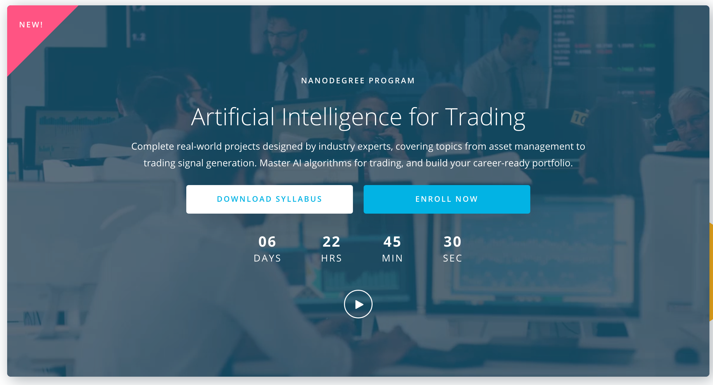

# Artificial Intelligence for Trading Nanodegree

Complete real-world projects designed by industry experts, covering topics from asset management to trading signal generation. Master AI algorithms for trading, and build your career-ready portfolio.

This repository contains the solution to the projects.

You should know that the content of the Nanodegrees changes often so some of the projects might be outdated. For the best experience, only read the solutions after completing them.

1. p1: Trading with Momentum
2. p2: Breakout Strategy 
3. p3: Smart Beta and Portfolio Optimization
4. p4: Alpha Research and Factor Modeling
5. p5: NLP on Financial Statements
6. p6: Sentiment Analysis with Neural Networks
7. p7: Combining Signals for enhanced Alphas
8. p8: Backtesting

