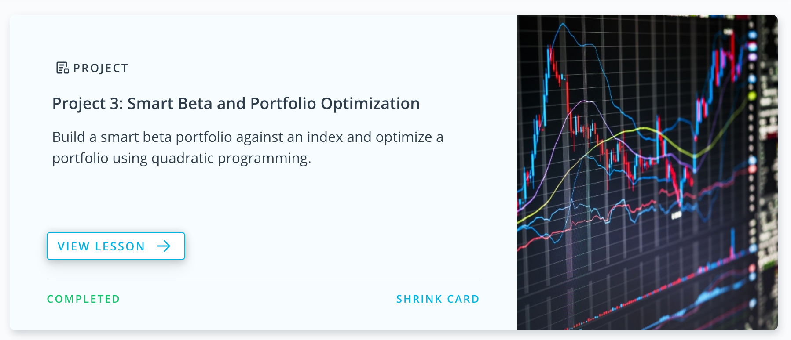

# Smart Beta and Portfolio Optimization

In this project, you will build a smart beta portfolio and compare it to a benchmark index. 
To find out how well the smart beta portfolio did, you’ll calculate the tracking error against the index. 
You’ll then build a portfolio by using quadratic programming to optimize the weights. 
Your code will rebalance this portfolio and calculate turn over to evaluate the performance. 
You’ll use this metric to find the optimal rebalancing Frequency. For the dataset, we'll be using the end of day 
from Quotemedia.

