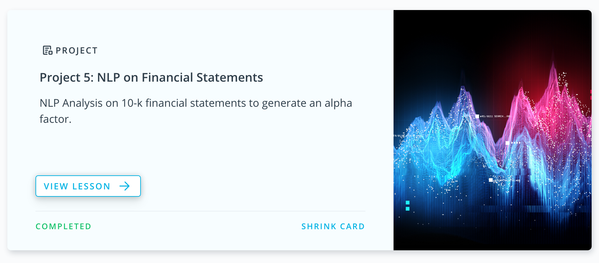

# NLP on Fincancial Statements

In this project, you'll do NLP Analysis on 10-k financial statements to generate an alpha factor. 
For the dataset, we'll be using the end of day from Quotemedia and Loughran-McDonald sentiment word lists.

